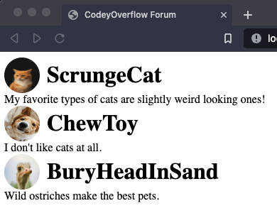
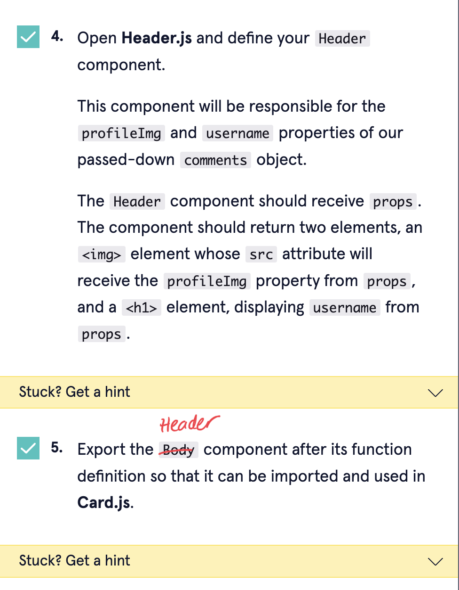
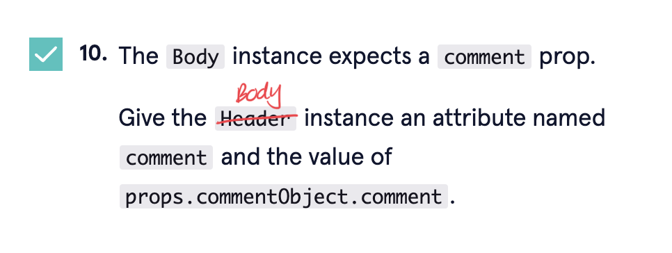

Codecademy project: CodeyOverflow Forum
======================================

Project description
-------------------
A simple project that lets you practise using props, and defining, rendering, and referencing components.

How to use this project
-------------------
I used Vite to set up my React app. Refer to https://vitejs.dev/guide/ to get yourself set up if you'd like to do this project locally.

Check my commits to see the work I did at each step. I misunderstood steps 2 and 4, and needed to redo them at the end of the project.

Additional tips
-------------------
Codecademy's instructions include a couple of typos:

* In step 5, it should say, "Export the `Header` component after its function definition so that it can be imported and used in Cards.js". 
&nbsp;&nbsp;&nbsp; 

* In step 10, it should say, "Give the `Body` instance an attribute named `comment` and the value of `props.commentObject.comment`". 
&nbsp;&nbsp;&nbsp; 
